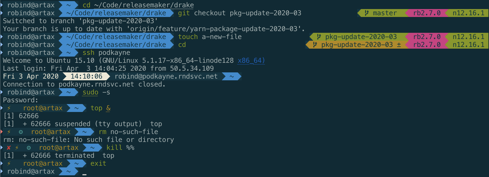

# robind.zsh-theme

A ZSH theme forked from [agnoster's theme](https://github.com/agnoster/agnoster-zsh-theme),
with the addition of the current date and time.



This theme shows:

- The date and time (for SSH sessions)
- Indication when the previous command failed (✘)
- Elevated (root) privileges (⚡)
- Presence of background tasks (⚙)
- User and hostname (if user is not `$DEFAULT_USER`)
- Working directory (the full path)
- Git and/or Mercurial status
  - Branch () or detached head (➦)
  - Current branch, or commit hash if in detached head state
  - Dirty working directory (±, color change)
- Active Ruby version (if [rbenv](https://github.com/rbenv/rbenv) is available)
- Name of the currently active Python virtual environment (if `$VIRTUAL_ENV` is set)

Optimized for:

- Solarized color themes
- Unicode-compatible fonts and terminal software

For Mac users, I highly recommend the Solarized Dark theme and the Menlo font. You need to have a terminal app or font that supports Powerline glyphs. (Included in the installation instructions.)

# Installation

Paste these commands to install the latest version of this theme and activate it:

```sh
mkdir -p ~/.oh-my-zsh/custom/themes
curl https://raw.githubusercontent.com/RobinDaugherty/robind-zsh-theme/master/robind.zsh-theme > ~/.oh-my-zsh/custom/themes/robind.zsh-theme
sed -i '.before-robind' -E 's/ZSH_THEME=.+$/ZSH_THEME="robind"/' ~/.zshrc
```

Or, if you prefer to do it manually, place the theme file in your `.oh-my-zsh/custom/themes/` directory (create the directory if it doesn't exist) and set your `ZSH_THEME` to "robind".

(See https://github.com/robbyrussell/oh-my-zsh/wiki/Customization#overriding-and-adding-themes for more detail.)

## Using iTerm (recommended)

1. Open preferences, go to the Profiles tab. Choose the profile you want to modify.
2. On the Text tab, check the "Use built-in Powerline glyphs" option. Change the font to "Menlo" (not required).
3. On the Colors tab, choose the Solarized Dark theme from the presets.

## Using Terminal.app

1. [Install the Solarized colors in Terminal](https://github.com/tomislav/osx-terminal.app-colors-solarized).
2. [Install the Powerline fonts](https://github.com/powerline/fonts).
3. Set the font in Terminal to use "Menlo Powerline".

## Compatibility

If you're not using one of the above terminal apps, to test if your terminal and font support this theme, check that all the necessary characters are supported by copying the following command to your terminal: `echo "\ue0b0 \u00b1 \ue0a0 \u27a6 \u2718 \u26a1 \u2699"`. The result should look like this:


If you are using a Powerline-patched font, and that still doesn't look right (especially the segment separator or branch symbols), then you may be using an old, incompatible version of the Powerline-patched fonts. ([They changed the character codes a few years ago.](https://github.com/robbyrussell/oh-my-zsh/issues/4065)) [Install a current version of the font.](https://github.com/powerline/fonts)

# Configuration

The theme can be configured by setting these environment variables:

* `DEFAULT_USER` - A user name you typically log in as, and which should be omitted from the prompt display when you are that user.

* `VIRTUAL_ENV_DISABLE_PROMPT` - If set, Python virtualenv will be disabled. It is enabled by default.

## Future Work

- Support for `rvm`
- Node version if using `nvm` or `nodenv`
